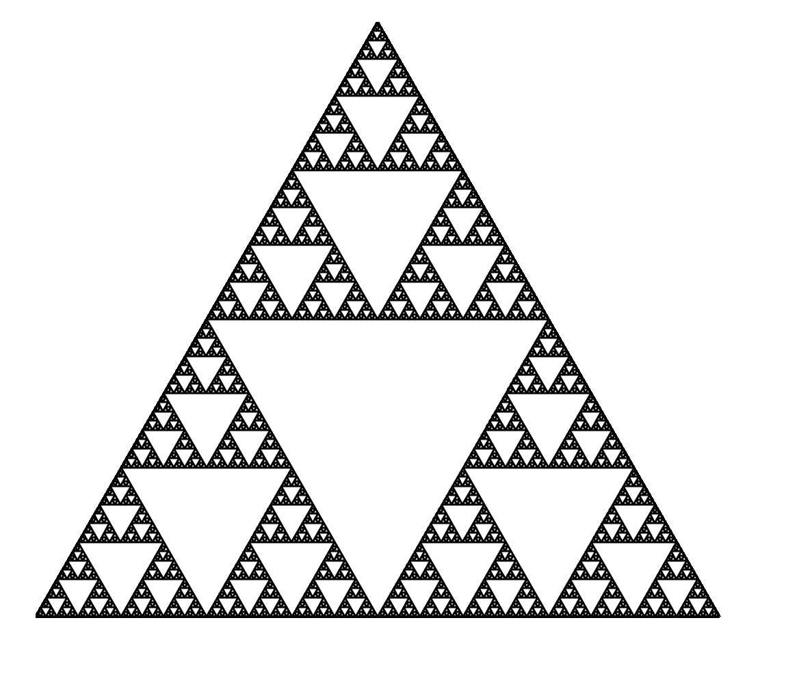
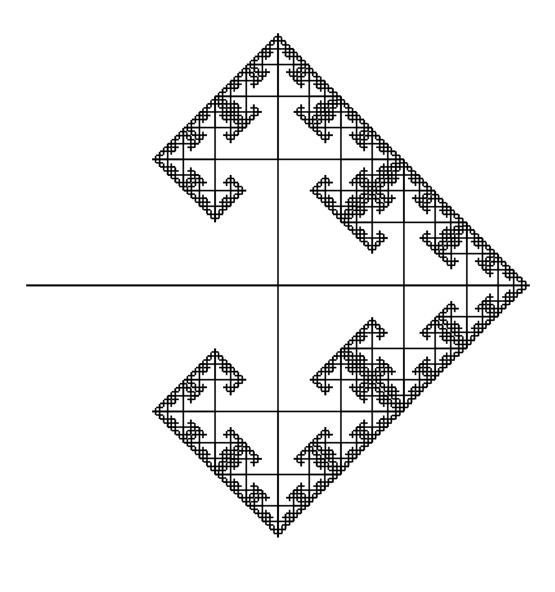
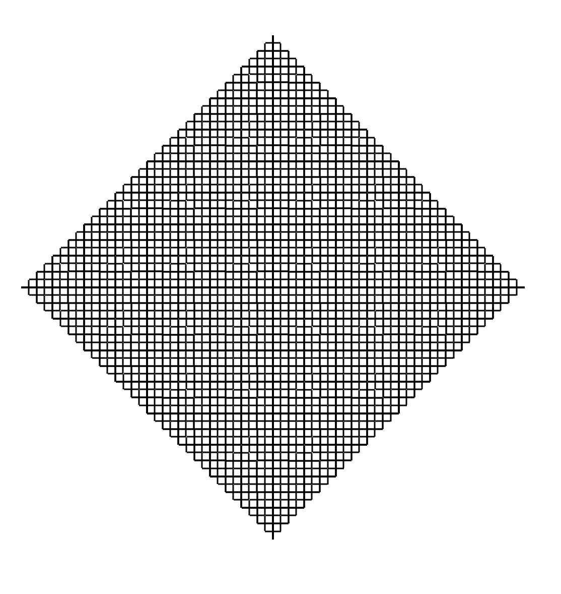

# elm-fractals
    A small collections of fractals made using elm.
Read my [journey](https://www.fifthtry.com/nilinswap/blog/hello-world/)

## How to run
- install elm
- install svg
    ```bash
    elm install elm/svg
    ```

- Compile elm

    ```elm
    elm make src/X.elm --output main.js
    ```


See page at `file://<path-to-index.html>` at browser.

## Fractals
- sierpinski.elm 
- barnsley.elm 
- mesh.elm  

Note: change level field in model to mention the recursion level.

    
